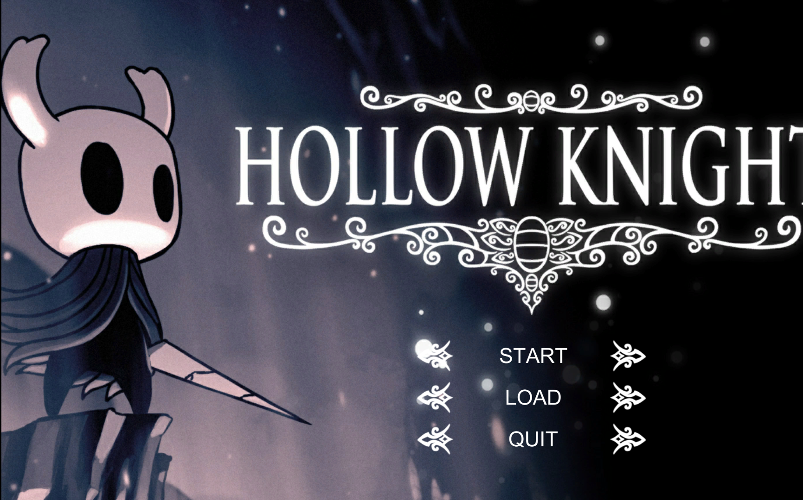
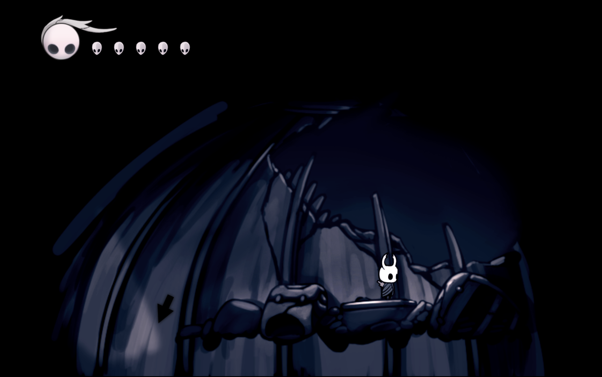
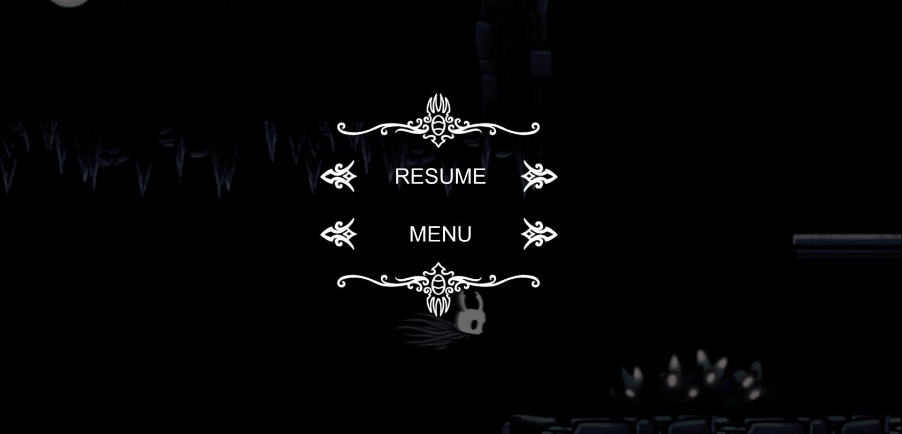
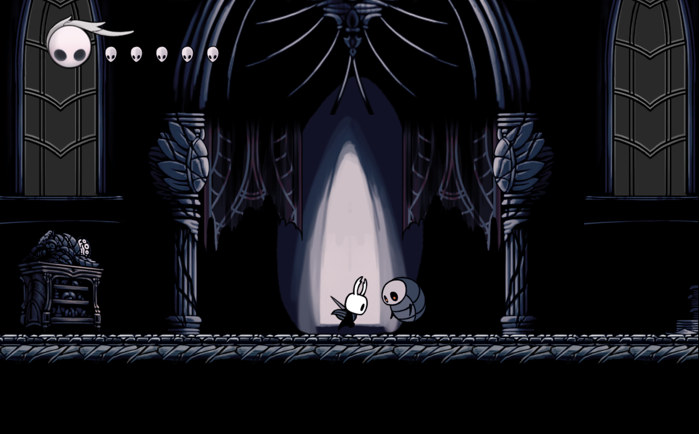
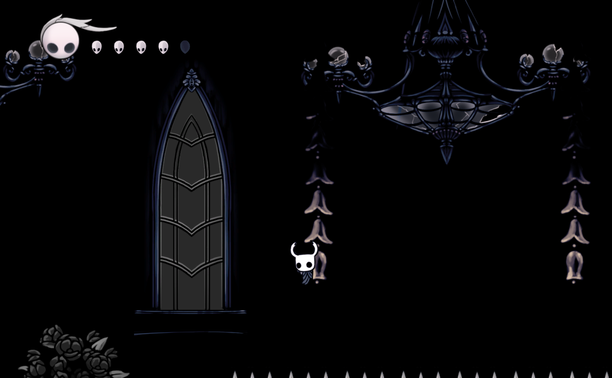

# Hollow Knight

This project is based on Unity 2018.3.6f1 and Bolt plug-in (now has been updated to Unity 2019.4.2f1 and C# scripts).

Star this repo if you like it!

### Screen shots

<b>Menu</b>

<b>Spawn</b>

<b>Enemy Chasing</b>

<b>Climb 1</b>

<b>Trigger (door opens at the same time)</b>

<b>Pause</b>

<b>Attack</b>

<b>Climb 2</b>

<b>Enemy Attacking</b>

<b>Moving Platform</b>

